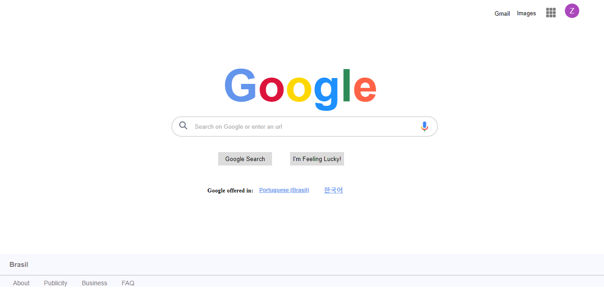

# HTML, CSS, and JavaScript

This is my first project using HTML, CSS and Javascript. 

For this learning process, I decided to replicate Google Search Engine with Google's Visual Identity. 

The searching is completely functional as well as some buttons. 

Here are some prints from this project.

  

